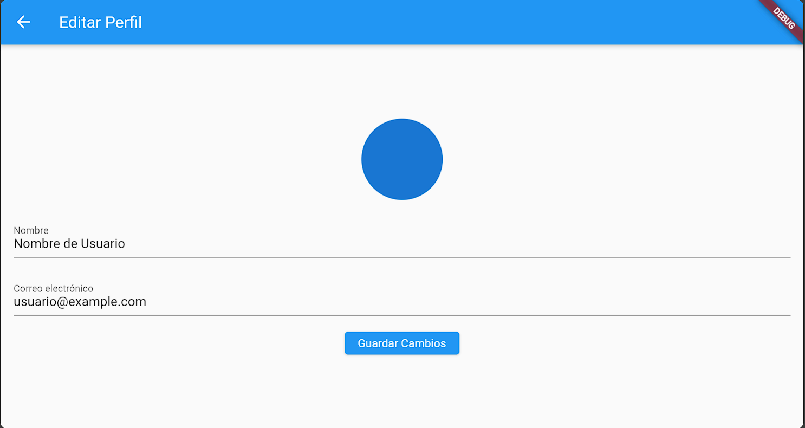
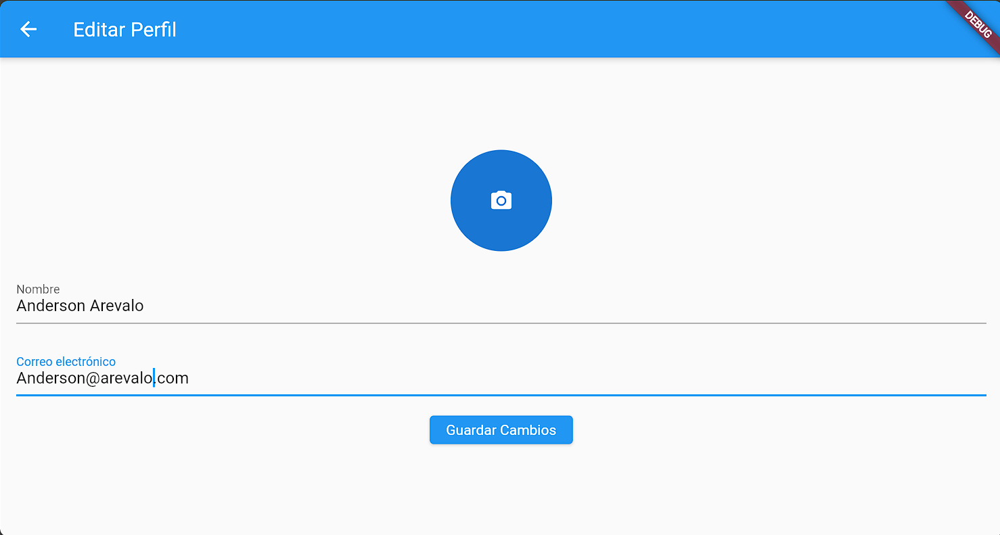
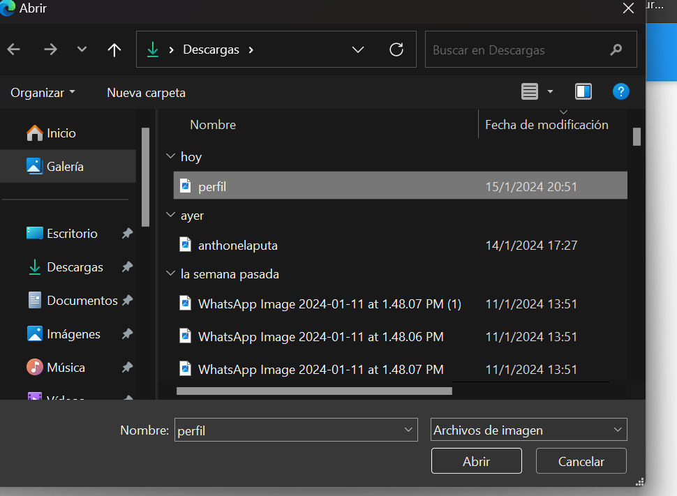
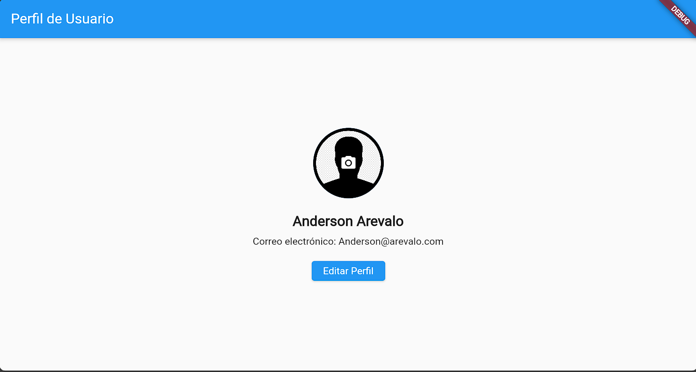

# Exploración del Contexto y Principios de Diseño en Flutter

## Objetivos de Aprendizaje:
   
   - Reconocer la importancia del contexto en Flutter para la construcción de interfaces de usuario.
   - Entender cómo se propaga el contexto a través de la jerarquía de widgets.
   - Aplicar el conocimiento del contexto para realizar acciones específicas en diferentes partes de la interfaz.

## Parte 1: Investigación y Conceptualización

### Investigación del Contexto en Flutter:

El `BuildContext` en Flutter representa la ubicación del widget en el árbol de widgets. Proporciona información sobre la posición del widget en la jerarquía de widgets y se utiliza para acceder a información específica del entorno, como el tema actual, la dirección de texto y para realizar acciones como la navegación entre pantallas.

En la jerarquía de widgets, el `BuildContext` es esencial para buscar y acceder a otros widgets, ya sea en el mismo nivel o en niveles superiores o inferiores. Puede obtenerse directamente de la mayoría de los métodos de construcción de widgets en Flutter.

    ```dart
    Widget build(BuildContext context) {
    // Acceder al BuildContext
    // ...

    return Scaffold(
        appBar: AppBar(
        title: Text('Ejemplo'),
        ),
        body: Center(
        child: ElevatedButton(
            onPressed: () {
            // Utilizar el BuildContext para navegar a otra pantalla
            Navigator.of(context).push(MaterialPageRoute(
                builder: (context) => OtraPantalla(),
            ));
            },
            child: Text('Ir a otra pantalla'),
        ),
        ),
    );
    }
    ```

### Principios Esenciales de Diseño en Flutter

1. **Coherencia:**
   - Los elementos de la interfaz de usuario deben mantener una apariencia coherente en todo el diseño.
   - Utilizar consistentemente colores, tipografía y elementos de interfaz en todas las pantallas.

2. **Usabilidad:**
   - Diseñar la interfaz de usuario de manera intuitiva para que los usuarios puedan entender y utilizar fácilmente.

3. **Legibilidad:**
   - Utilizar una tipografía clara y un tamaño de texto adecuado para mejorar la legibilidad.
   - Asegurarse de que el contenido sea fácil de leer en diferentes tamaños de pantalla.

4. **Feedback:**
   - Proporcionar retroalimentación visual y/o auditiva sobre las acciones realizadas por el usuario.
   - Incorporar animaciones y mensajes de estado para mejorar la experiencia del usuario.

5. **Eficiencia:**
   - Optimizar el rendimiento de la aplicación para garantizar una respuesta rápida a las interacciones del usuario.
   - Minimizar la carga innecesaria de recursos para mejorar la eficiencia general.

6. **Estética:**
   - Buscar un equilibrio entre la funcionalidad y la estética para crear interfaces atractivas.
   - Utilizar elementos visuales, como imágenes y espaciado, de manera armoniosa para mejorar la apariencia general.

Estos principios son esenciales para desarrollar aplicaciones Flutter que ofrezcan una experiencia de usuario consistente, fácil de usar y estéticamente agradable.

Creación de la Pantalla de Perfil de Usuario:

Utilizar widgets como MediaQuery, Navigator o InheritedWidget para acceder al BuildContext según sea necesario.
Aplicar los principios de diseño seleccionados para garantizar una interfaz intuitiva y estéticamente agradable.
Responsividad:

## Parte 2: Desarrollo Práctico
### Creación de la Pantalla de Perfil de Usuario:

Utilizar widgets como `MediaQuery`, `Navigator` o `InheritedWidget` para acceder al `BuildContext` según sea necesario.
Aplicar los principios de diseño seleccionados para garantizar una interfaz intuitiva y estéticamente agradable.

### Responsividad:

Utilizar `Flexible`, `Expanded` y `LayoutBuilder` para garantizar un diseño que responda a cambios en la orientación y tamaño de pantalla.

### Capturas de Pantalla

1. **Imagen Perfil Usuario Default**

2. **Imagen Editar Perfil Usuario Default**

3. **Imagen Editar Perfil Usuario Datos**

4. **Imagen Editar Perfil Usuario Imagen**

5. **Imagen Perfil Usuario Editado**



